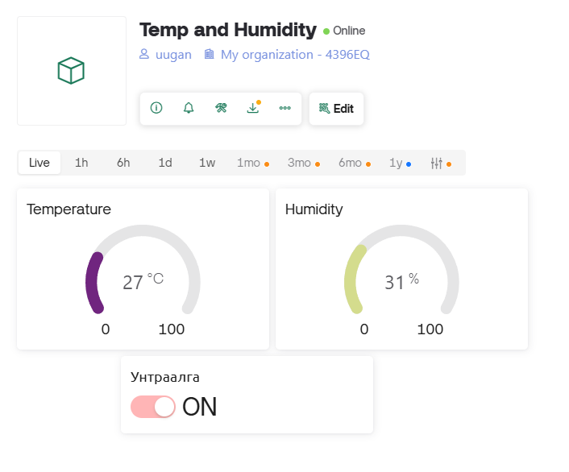
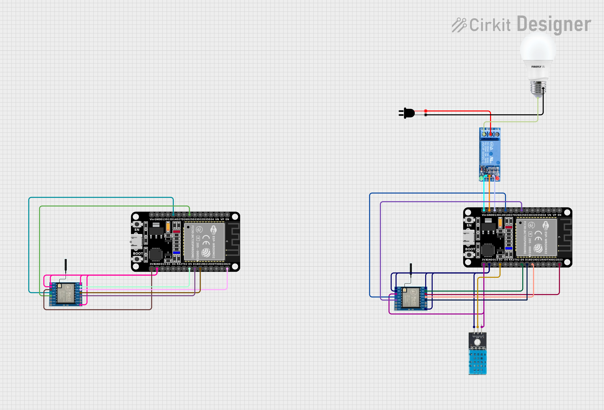

# ESP32 LoRa Temperature & Humidity System

This project consists of two ESP32-based nodes communicating via LoRa.
The **client node** reads temperature and humidity from a sensor, sends it every 5 seconds to the **server node**, and listens for commands (`relay_on`, `relay_off`).
The **server node** connects to WiFi & Blynk, forwards data to Blynk, and relays control commands back to the client node.

---

## 📋 Features

✅ Client node:
- Reads temperature & humidity
- Sends data over LoRa every 5 seconds
- Receives relay control commands (`relay_on`, `relay_off`) over LoRa

✅ Server node:
- Connects to WiFi & Blynk cloud
- Receives data from client over LoRa
- Sends data to Blynk every 15 minutes
- Receives commands from Blynk and forwards them to client over LoRa

Here is the Blynk dashboard:

---

## 🛠 Hardware

- 2 × ESP32 Dev Boards
- 2 × LoRa SX1278 modules
- 1 × DHT11 or similar temperature & humidity sensor
- 1 × Relay module 
- Jumper wires, breadboard or PCB


---


## 📁 File Structure

├── client.ino # LoRa client (sensor) code
├── server.ino # LoRa server (WiFi & Blynk) code
├── secret.h # WiFi & Blynk credentials (not tracked in git)
├── .gitignore # ignores secret.h and build artifacts
├── README.md # this file

---

## 🔒 Secrets

Create a `secret.h` file in the project folder (excluded from git) with:
```cpp

#define BLYNK_TEMPLATE_ID "YourTemplateId"
#define BLYNK_TEMPLATE_NAME "YourBlynkTemplateName"
#define BLYNK_AUTH_TOKEN "YourBlynkToken"

#define WIFI_SSID     "YourWifiSSID"
#define WIFI_PASSWORD "YourWifiPassword"

🚀 Getting Started
On the client node:
Flash client.ino to ESP32 #1.

Connect LoRa module & sensor.

Power it on.

On the server node:
Flash server.ino to ESP32 #2.

Connect LoRa module.

Make sure secret.h is configured with your WiFi & Blynk credentials.

Power it on.

On Blynk:
Create a new project.

Add widgets for temperature, humidity, and buttons to control relay.

Use the auth token in secret.h.

📖 License
MIT License © uugan